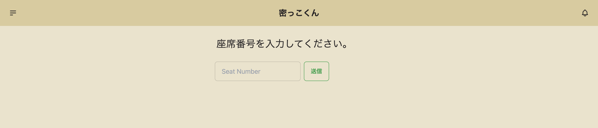
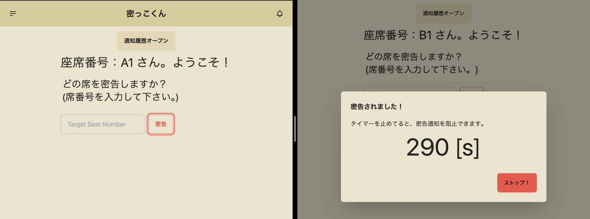
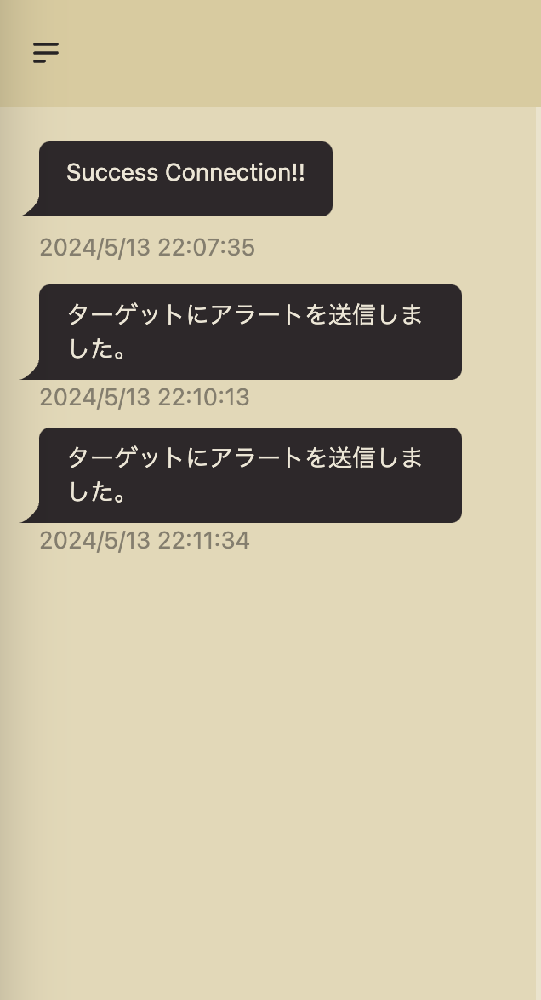
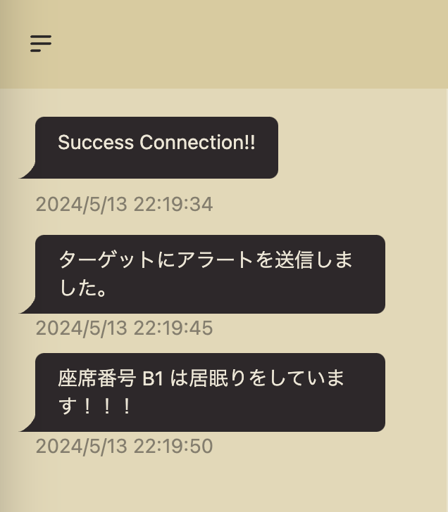

# 密っこくん (バックエンド)
---
## 概要
このアプリは居眠りしている人を密告できるアプリのバックエンド(API)です。
送信するテキストを変えることで様々な場面で使用できます。

## 前提
- フロントエンドは以下URLを使用して下さい。(または参考にして下さい。)
  - https://github.com/Inoue416/mikkokun-frontend
- このアプリは座席番号がある場面で使用できます。
- 開発途中のため、まだまだ汎用的に使用することはできません。

## 技術スタック
- Golang
- gin
- gorilla/websocket
- Swaggo (swagger)

他の詳細はgo.modを参照して下さい。


## コマンド一覧
```
go run main.go    # local環境でhttpアプリ起動

# TODO: コマンドを書き増やす
```

## 実行画面 (フロントのREADMEと共通)
### ホーム画面


### 密告画面



### タイムオーバーによるブロードキャスト


## 注意
- 開発途中のため不完全、バグがある場所が多く存在する可能性が高いです。ご使用際は自己責任でお願いします。

